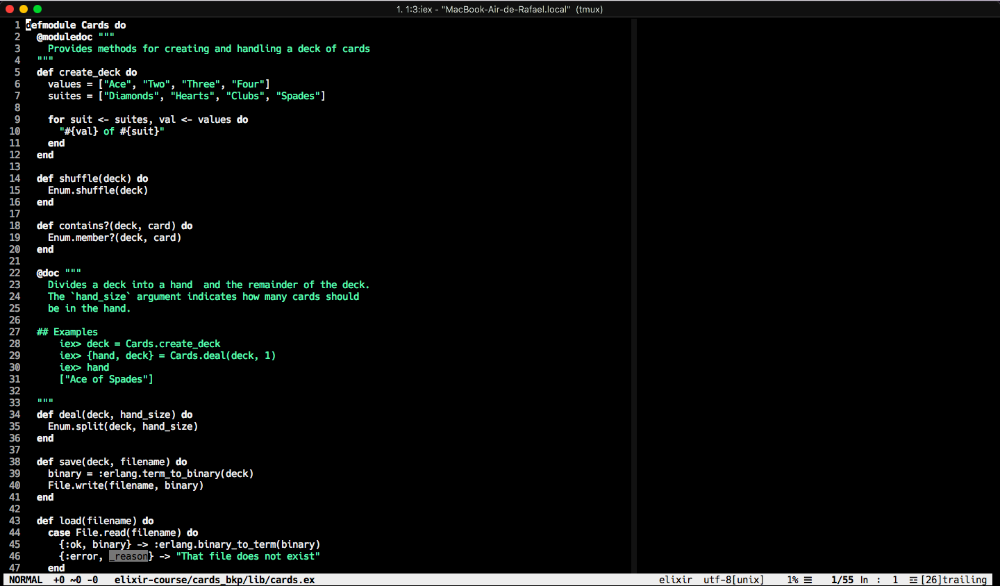

## greenisgood - A dark Vim hacker color scheme +)

### Enjoy \o

`vim-greenisgood` works in GUI/true-color terminals, as well as 256-color terminals:

<p align="center">

</p>

### Installation

Installation depends on how you manage packages. For example, with
[Vundle](https://github.com/VundleVim/Vundle.vim) add

```
Plugin 'rfunix/vim-greenisgood'
```

to your init file.

### Configuration

Just throw this to your _~/.vimrc_:

```
colorscheme greenisgood
```

It is important that the flag is set before loading the theme.

Strong inspired in vim-monochrome: https://github.com/fxn/vim-monochrome/
